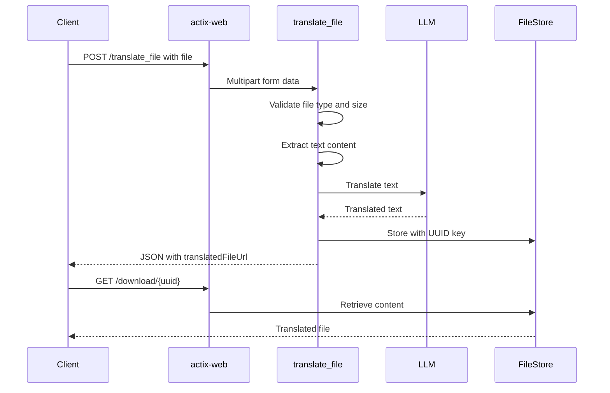

# PRIMARY TODO: Implement /translate_file Endpoint

## Objective

- Implement LibreTranslate-compatible `/translate_file` endpoint for document translation.
- Enable users to upload files and receive translated documents.

## Interface / Artifact Contract

### Request

- **Method**: POST `/translate_file`
- **Content-Type**: `multipart/form-data`
- **Parameters**:
  - `file` (required): File to translate
  - `source` (required): Source language code or "auto"
  - `target` (required): Target language code
  - `api_key` (optional): API key if server requires one

### Response

- **Success**: JSON with `translatedFileUrl` field pointing to downloadable translated file
- **Error**: JSON with `error` field and appropriate HTTP status

### Frontend Settings Update

- `filesTranslation`: `true`
- `supportedFilesFormat`: `[".txt"]` (initially)

## Required Scenarios

1. **Happy path**: Upload `.txt` file, receive translated file URL, download translated content.
2. **Auto-detect source**: Upload file with `source=auto`, detect language, translate.
3. **Error handling**: Invalid file type, missing parameters, file too large.
4. **API key validation**: Enforce key if server configured with one.

## Execution Plan

### Phase 1: Core Implementation

1. [ ] Add file upload handling dependencies if needed
   - Verify `actix-multipart` covers file field handling
   - Add `tempfile` crate for temporary file management

2. [ ] Create request/response types for file translation
   - `TranslateFileRequest` struct with multipart fields
   - `TranslateFileResponse` struct with `translatedFileUrl`

3. [ ] Implement file upload processing
   - Extract file content from multipart form
   - Validate file type (`.txt` only initially)
   - Enforce file size limits

4. [ ] Implement translation logic
   - Read file content as UTF-8 text
   - Reuse existing `translate` logic for text translation
   - Handle encoding errors gracefully

5. [ ] Implement file serving mechanism
   - Generate unique download IDs
   - Store translated content in memory or temp directory
   - Create `/download/{id}` endpoint to serve translated files

6. [ ] Update frontend settings
   - Set `filesTranslation: true`
   - Set `supportedFilesFormat: [".txt"]`

### Phase 2: Polish and Testing

7. [ ] Add error handling
   - Invalid file type (415 Unsupported Media Type)
   - File too large (413 Payload Too Large)
   - Encoding errors (400 Bad Request)
   - Missing parameters (400 Bad Request)

8. [ ] Add integration tests
   - Test file upload and translation
   - Test auto-detect source language
   - Test error scenarios

9. [ ] Update documentation
   - Update `ARCHITECTURE.md` API surface
   - Update `PORTABLE_APP.md` with supported formats
   - Update `README.md` feature list

## Evidence

- `curl -F "file=@test.txt" -F "source=en" -F "target=es" http://localhost:5050/translate_file` returns JSON with `translatedFileUrl`
- Download URL returns translated file content
- Frontend file translation UI works end-to-end
- All tests pass: `cargo test`

## Acceptance Criteria

- [ ] `/translate_file` accepts `.txt` file uploads
- [ ] Returns downloadable translated file URL
- [ ] Supports `source=auto` for language detection
- [ ] Validates API key when configured
- [ ] Returns appropriate errors for invalid inputs
- [ ] Frontend settings reflect file translation capability
- [ ] Documentation updated to reflect new feature

## Defaults Chosen

- **Initial file format**: `.txt` only (plain text). HTML, DOCX, PDF can be added later.
- **File storage**: In-memory with UUID-based download IDs. Simpler than temp files, suitable for single-instance deployment.
- **Size limit**: Reuse existing `char_limit` for translated content; add separate `file_size_limit` CLI arg (default 10MB).
- **Download expiry**: Translated files available for 1 hour (cleanup via background task or on-demand).

## Architecture Diagram

## Key Files to Modify

| File | Changes |
|------|---------|
| `ltengine/src/main.rs` | Add `translate_file` handler, `download` endpoint, file store |
| `ltengine/Cargo.toml` | Add `tempfile` or `uuid` crate if needed |
| `.kilocode/rules/ARCHITECTURE.md` | Update API surface documentation |
| `docs/PORTABLE_APP.md` | Update supported formats list |
| `README.md` | Update feature list |
